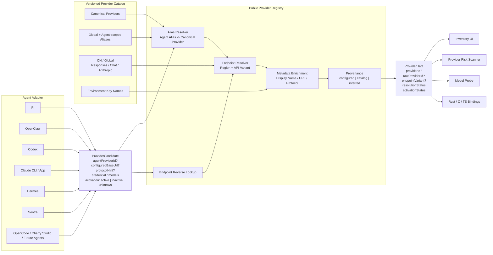

RiskChecker
    new(
        options: ScanOptions,
        rules: RuleStore,
        cache: CheckResultCache
    )

修改cli子命令：scan
当前只需要实现skill即可，但是要考虑扩展性,配置文件在 ~/.sentra/config.json
逻辑时先采集资产然后调用RiskScann.scan

sentra scan skill(cron, memory, xxx) --agent codex-cli --agent claude

默认扫描所有agent

支持
xxx == hash yara ti llm online-ti
--with-xxx
--without-xxx

默认 --with-hash --with-yara --with-ti
并通过with-xxx，扩展
如果有without-xxx，则从 with 中删除 xxx

## Provider Registry

LLM Provider 扫描分为 Agent 配置解析与公共供应商知识解析两层。Agent Adapter 只负责读取本地事实；Provider Registry 负责标准化供应商身份、补全缺失 Endpoint、选择协议变体并标记字段来源。

解析优先级：

1. Agent 配置中的显式 URL 和协议，不允许 Catalog 覆盖。
2. Agent-scoped Alias，可同时指定 Canonical Provider 和 Endpoint Variant。
3. Canonical Provider 或全局 Alias 的默认 Endpoint。
4. 根据显式 Endpoint 反向识别供应商；只在唯一匹配时采用。
5. 无法识别时保留原始条目，不猜测或丢弃。

识别状态：

- `known`：Catalog 中唯一匹配的供应商。
- `custom`：存在显式 Endpoint，但 Catalog 未收录。
- `unknown`：存在 Provider ID，但缺少足够信息进行识别。
- `ambiguous`：多个 Catalog 条目均可能匹配。

边界约束：

- Catalog 不保存真实 API Key，只维护认证方式所需的环境变量名等元数据。
- `activationStatus` 由 Agent Adapter 决定；Registry 不推测当前激活项。
- Agent 的 Provider 写入和删除逻辑继续归各 Adapter 所有，Registry 只负责标准化与补全。
- 同一 Base URL 可以对应多个协议变体，供应商身份识别和 Endpoint Variant 识别必须分别处理。
- Catalog 作为仓库内版本化快照发布，运行时不依赖网络更新。
